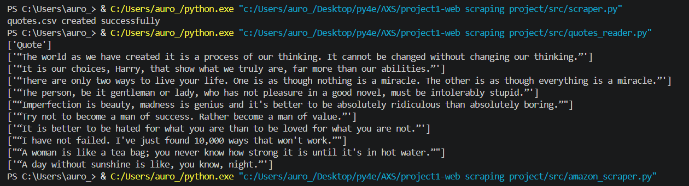

# Web Scraping Python Project

## Overview

This project demonstrates web scraping using Python. It extracts quotes from a website, stores them in a CSV file, and reads the data for display.

This project is designed to showcase real-world data extraction, file handling, and project structuring skills.

---

## Features

* Scrapes quotes from a live website
* Saves extracted data into a CSV file
* Reads and displays CSV data
* Uses clean folder structure for real-world projects

---

## Technologies Used

* Python
* Requests
* BeautifulSoup (bs4)
* CSV Module
* OS Module

---

## Project Structure

```
web-scraping-python-project/
│
├── src/
│   ├── scraper.py
│   └── quotes_reader.py
│
├── data/
│   └── quotes.csv
│
├── screenshots/
│   └── output.png
│
├── requirements.txt
└── README.md
```

---

## Installation

1. Clone the repository:

```
git clone https://github.com/sriarchu16/web-scraping-python-project.git
cd web-scraping-python-project
```

2. Install required libraries:

```
pip install -r requirements.txt
```

---

## How to Run

### Step 1: Run the scraper

This will fetch quotes and create a CSV file.

```
python src/scraper.py
```

### Step 2: Run the reader

This will read and display quotes from the CSV file.

```
python src/quotes_reader.py
```

---

## Output Example

```
Quote
"The world as we have created it is a process of our thinking..."
"It is our choices, Harry, that show what we truly are..."
```

---

## Screenshots


```

```

---

## Notes

* Make sure to run `scraper.py` before running `quotes_reader.py`
* Internet connection is required for scraping

---

## Future Improvements

* Add author name along with quotes
* Store data in database (SQLite/MySQL)
* Add error handling and logging
* Convert project into API using FastAPI
* Schedule scraping automatically

---

## Author

* Python Developer (Beginner to Intermediate)
* Focused on real-world projects and automation

---
